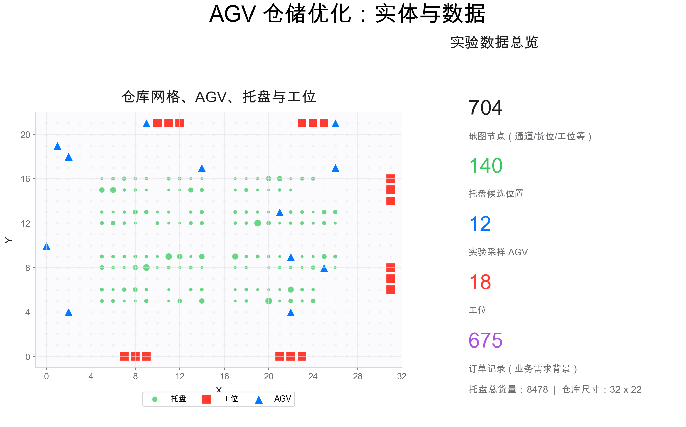
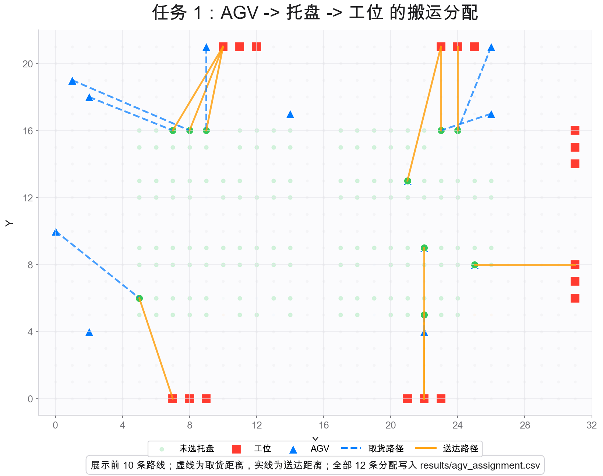
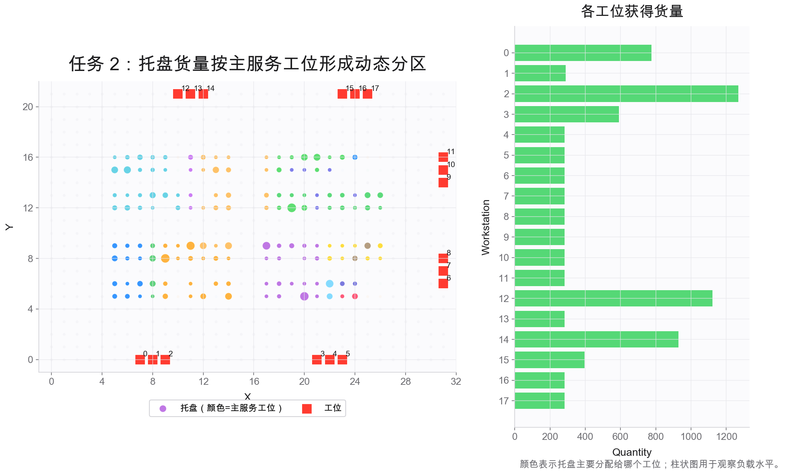
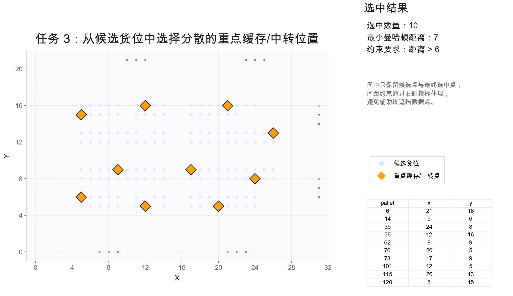
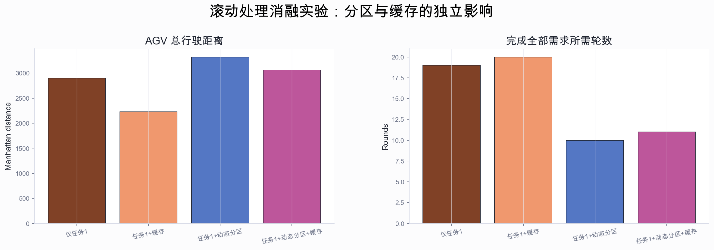
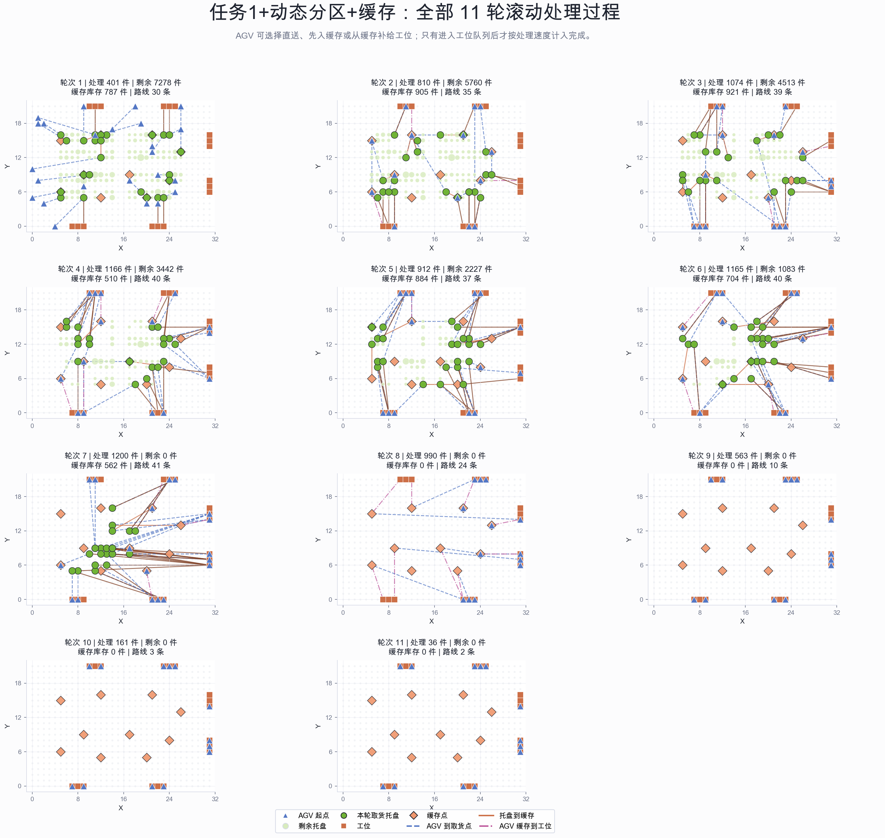

# AGV 仓储优化课程项目

语言：中文 | [English](README.en.md)

这个仓库是一个完整的 AGV 仓储优化课程项目。项目使用本地 CSV 数据、自动化建模脚本和我们自己实现的教材优化算法，完成三个仓储决策实验：AGV 搬运分配、动态分区、重点缓存货位选择。

README 按演示汇报的顺序展开：先讲背景、实体和数据，再讲三个任务的实际意义、建模方式、教材章节对应算法、实验设置和结果分析。

## 1. 实验背景、仓库实体与数据

自动化仓库中，AGV 负责在仓库网格和通道上搬运托盘。它们看起来只是“从一个点开到另一个点”，但在真实运营里，AGV 调度和仓储布局会直接影响搬运成本、订单处理速度、工位等待时间和局部拥堵情况。

可以把这个项目理解成一个小型智能仓储决策系统：仓库中已经有一批托盘、若干 AGV 和多个工位，现在需要回答三个连续的问题：

- **当前这一批货谁来搬？** 例如晚高峰有一批订单要出库，12 辆 AGV 都在不同位置，如果随便派车，可能会让远处车辆跨仓库空驶；如果优化分配，就能让更近的 AGV 去取更合适的托盘，减少无效行驶距离。这对应 **任务 1：AGV 任务分配**。
- **不同工位分别处理哪些货量？** 例如某些工位附近托盘多、距离短，但如果所有货都分给最近工位，就可能让个别工位负载过高，其他工位空闲。动态分区的意义就是在总距离和工位负载之间做权衡，让货量分配更均衡。这对应 **任务 2：动态分区**。
- **哪些位置适合作为缓存或中转点？** 例如高频补货、出库暂存或工位前缓存都需要一些重点位置，但这些位置如果挤在一起，会造成 AGV 会车、排队和局部拥堵。选址模型需要在候选货位中挑出一组分散且有价值的位置。这对应 **任务 3：重点缓存货位选择**。

因此，本项目的现实意义不只是求出一个数学最优解，而是把仓库中的运营问题转化成可计算、可复现、可解释的优化模型：

- **节约搬运成本**：减少 AGV 空驶和绕路，降低电量消耗、设备磨损和人工干预成本；
- **提升作业效率**：缩短取货和送达路径，提高单位时间内可完成的搬运任务数量；
- **稳定工位负载**：避免某些工位过载、某些工位空闲，提高整体产线或仓库处理节奏；
- **降低拥堵风险**：让重点缓存/中转位置保持一定间距，减少局部排队和通道冲突；
- **支持管理决策**：用统一的数据和模型说明“为什么这样派车、为什么这样分区、为什么选这些位置”。



本项目涉及的实体如下：

- **AGV**：自动导引运输车，是仓库中的无人搬运资源。图中的 AGV 坐标表示当前调度批次开始前的车辆初始位置，也就是调度时刻 `t0` 的状态快照；它不是历史轨迹点，也不是任务完成后的最终位置。任务 1 中，AGV 从这个初始位置出发，到某个托盘位置取货，再把托盘送到工位。
- **托盘**：承载货物的标准单元。`pallets.csv` 中每个托盘有坐标、托盘编号，以及若干 SKU 的数量；模型把 SKU 数量加总为托盘货量。
- **工位**：仓库或生产线中的作业位置，可以理解为拣选、包装、加工、检验或临时处理点。`map.csv` 中类型为 `5` 的节点被读取为工位。
- **仓库区域**：任务 2 中的区域不是提前画好的固定房间，而是模型根据“托盘货量分给哪个工位”自动形成的服务范围。
- **候选货位**：任务 3 中可以被选为重点缓存或中转点的备选位置。当前实验把已有托盘/货位坐标作为候选点。
- **通道/关键节点**：`map.csv` 中的道路节点、货位节点、充电桩、连接节点和工位共同描述仓库网格结构。当前模型用曼哈顿距离近似 AGV 在网格通道中的行驶距离。

距离定义为：

```text
dist(a, b) = |x_a - x_b| + |y_a - y_b|
```

### 图示实体与辅助标注规则

为了让所有图保持同一套视觉语义，README 中的图例只展示本项目定义过的仓库实体；路径、颜色编码、约束说明等放在图旁文字里，不再混进实体图例。

实体图例统一如下：

| 实体 | 图中颜色 | 说明 |
| --- | --- | --- |
| AGV | 蓝色三角形 | 车辆当前位置或车辆起点 |
| 托盘 | 绿色圆点 | 已有托盘位置，圆点大小通常表示托盘货量 |
| 工位 | 红色方块 | 拣选、包装、加工或临时处理点 |
| 候选货位 | 浅蓝圆点 | 任务 3 中可被选择的备选位置 |
| 重点缓存/中转点 | 橙色菱形 | 任务 3 最终选出的缓存或中转位置 |

辅助标注不属于实体：

- 任务 1 中的蓝色虚线和橙色实线只是路线说明，分别表示 `AGV -> 托盘` 和 `托盘 -> 工位`；
- 任务 2 中托盘的多种颜色表示“该托盘主要由哪个工位服务”，也就是动态形成的工位服务区域；仓库区域不是一个固定物理点，所以不单独放进实体图例；
- 背景中的通道、货位、充电桩、连接节点等只用于展示地图结构，不作为本项目的独立决策实体。

### 数据集说明

本项目的数据不是运行时临时生成的空数据，而是保存在 `data/` 目录下的本地仓库 CSV。程序每次运行都会从这些 CSV 读取坐标、货量、AGV 位置和订单需求背景，再自动构造优化模型。

| 文件 | 字段 | 数据规模 | 现实含义 | 在模型中的作用 |
| --- | --- | --- | --- | --- |
| `data/map.csv` | `Type`, `X`, `Y`, `All_Car`, `Free_Car` | 704 个地图节点，仓库尺寸 32 x 22，其中类型 `5` 的工位有 18 个 | 仓库网格、通道、货位、充电桩、连接节点和工位 | 读取仓库节点与工位坐标，支撑三项任务的曼哈顿距离计算 |
| `data/pallets.csv` | `{SKU:Amount} List`, `X`, `Y`, `Pallet ID` | 140 个托盘，托盘货量总和 8478，单托盘货量范围 26 到 192 | 仓库中已有的托盘库存和货位分布 | 提供托盘坐标、托盘货量、任务 3 的候选货位 |
| `data/bots.csv` | `car_id`, `x`, `y`, `方向` | 50 辆 AGV 的位置数据，默认实验采样 12 辆参与任务 1 | 当前仓库中的可调度车辆状态 | 提供任务 1 的 AGV 起点；方向字段保留但当前距离模型暂未使用 |
| `data/orders.csv` | `Order ID`, `SKU`, `Required Amount`, `Order Received Time`, `Deadline Time` | 675 条订单记录，181 个不同 SKU，需求总量 8478 | 订单需求背景，说明仓库为什么需要搬运和补货 | 当前三项模型直接使用托盘库存和位置；订单数据用于说明业务需求规模，也可扩展到按订单调度 |

数据之间的关系可以这样理解：

- `map.csv` 给出仓库空间结构，相当于“AGV 能在哪里走、工位在哪里”。
- `pallets.csv` 给出库存状态，相当于“货物现在放在哪里、每个托盘有多少货”。
- `bots.csv` 给出车辆状态，相当于“在调度开始前，当前有哪些 AGV 可以从哪些位置出发”。因此图一和图二中的蓝色三角形都是同一个含义：当前批次的 AGV 初始位置快照。
- `orders.csv` 给出需求背景，相当于“为什么这些货物需要被处理”。订单需求总量为 8478，与托盘总货量 8478 一致，因此它可以解释当前库存/需求批次的业务规模。

读取数据后，代码会做以下预处理：

- 跳过 CSV 中的说明行和注释行；
- 将 `pallets.csv` 中的 `"SKU:数量,SKU:数量"` 字符串解析为字典，并把每个托盘内的 SKU 数量加总为托盘货量 `q(j)`；
- 从 `map.csv` 中提取类型为 `5` 的节点作为工位坐标；
- `map.csv` 中的类型 `1/2/3/4/6/7/8` 在当前实验中只作为仓库背景节点或原始地图节点保留，不作为单独的决策实体，因此配图图例不再展示“节点 6/7/8”这类容易误导的标签；
- 从 `bots.csv` 中读取 AGV 坐标，默认用固定随机种子抽取 12 辆，表示一个可复现的当前调度批次；
- 用坐标构造 AGV-托盘、托盘-工位、托盘-托盘距离矩阵。

三项任务使用数据的方式不同：

| 任务 | 使用的数据 | 数据进入模型的方式 |
| --- | --- | --- |
| 任务 1：AGV 任务分配 | `bots.csv`, `pallets.csv`, `map.csv` | AGV 坐标、托盘坐标、工位坐标共同形成两段路径成本：`AGV -> 托盘 -> 工位` |
| 任务 2：动态分区 | `pallets.csv`, `map.csv` | 托盘货量作为供给量，托盘到工位距离作为单位分配成本 |
| 任务 3：重点缓存货位选择 | `pallets.csv`, `map.csv` | 现有托盘/货位坐标作为候选点，托盘间距离形成空间冲突约束 |

默认实验中的随机数只用于任务 1 的 AGV 抽样。它对应现实中的“当前批次可调度车辆集合”，不是随机生成仓库、托盘或工位；仓库地图、托盘位置、托盘货量和订单数据都来自固定 CSV，因此实验可以直接复现。

## 2. 项目内容

项目包含三个优化任务：

1. **AGV 任务分配**：决定哪辆 AGV 去搬哪个托盘，并送到哪个工位。
2. **动态分区**：决定每个托盘的货量由哪些工位处理，从而形成工位服务区域。
3. **重点缓存货位选择**：从候选货位中选出一组适合作为重点缓存或中转的位置。

这三个任务对应仓库运行的三个层面：当天调度、区域组织和布局规划。它们不是同一个问题的重复求解，而是从短期搬运到中长期布局的递进。

## 3. 自动化建模与求解流程

整个项目已经自动化实现。运行 `python run_all.py` 后，程序会依次读取数据、构造距离矩阵、生成目标函数和约束矩阵、调用教材算法求解，并把结果写入 `results/`。

```text
CSV 数据
  -> warehouse_data.py 读取坐标、货量、AGV、工位
  -> solve_*.py 构造目标向量和约束矩阵
  -> algorithms/*.py 调用教材算法求解
  -> results/*.csv 输出实验结果
```

仓库结构：

```text
data/                         本地仓库 CSV 数据
figures/                      README 中使用的实验示意图
algorithms/                   教材算法的 Python 实现
warehouse_data.py              数据读取与距离矩阵构造
solve_agv_assignment.py        任务 1：AGV 任务分配
solve_dynamic_partition.py     任务 2：动态分区
solve_warehouse_layout.py      任务 3：重点缓存货位选择
solve_multi_period.py          初始总需求滚动处理消融实验
run_all.py                     一键运行三个实验
results/                       输出 CSV 结果
scripts/make_readme_figures.py README 配图生成脚本
```

默认问题规模：

| 任务 | 默认规模 |
| --- | --- |
| 任务 1 | 12 辆 AGV、140 个托盘、18 个工位；线性规划 4498 个变量、450 条等式约束 |
| 任务 2 | 140 个托盘、18 个工位；线性规划 2538 个变量、158 条等式约束 |
| 任务 3 | 140 个候选货位中选 10 个；连续松弛 140 个变量、2165 条空间冲突边 |

## 4. 任务 1：AGV 任务分配



### 实际意义

任务 1 解决“谁去搬、搬到哪里”的问题。一条结果可以读成：

```text
AGV i 从当前位置出发，到托盘 j 取货，再把托盘 j 送到工位 k。
```

这里的“当前位置”指调度开始前 `t0` 时刻的 AGV 初始位置。图中的蓝色三角形不是车辆运行轨迹，而是模型读取 `bots.csv` 后得到的车辆起点。每条蓝色虚线表示一辆 AGV 从起点到被分配托盘的取货段；橙色实线表示该托盘到工位的送达段。若某辆 AGV 的初始位置正好和被分配托盘坐标重合，则该取货段距离为 0，图上不会出现明显的蓝色虚线，这表示 AGV 已经在托盘位置，而不是没有被分配任务。

如果分配不好，AGV 会产生额外空驶、绕路和工位等待；如果分配合理，可以降低取货与送货距离，提高当前调度批次的执行效率。

### 建模方法

一次搬运被拆成两段距离：

```text
AGV -> 托盘
托盘 -> 工位
```

决策变量：

```text
x(i,j)：AGV i 是否服务托盘 j
y(j,k)：托盘 j 是否送到工位 k
```

目标函数：

```text
min sum d(AGV_i, pallet_j) x(i,j)
  + sum d(pallet_j, workstation_k) y(j,k)
```

主要约束包括：

- 每辆参与实验的 AGV 分配一个搬运任务；
- 每个托盘最多被一辆 AGV 取走；
- 取货和送达必须保持一致；
- 每个工位接收的托盘数不超过容量上限。

### 教材算法

任务 1 被构造成线性规划松弛，使用 **教材第 7 章：线性规划的原始-对偶内点法** 求解。代码位于 `algorithms/primal_dual_lp.py`。

内点法求解的是：

```text
min c^T x
s.t. A x = b, x >= 0
```

算法维护原变量 `x`、对偶变量 `y` 和松弛变量 `s`，通过牛顿方向逐步降低原始残差、对偶残差和互补间隙。得到连续解后，`solve_agv_assignment.py` 会执行整数恢复，把松弛解转成可执行的 AGV-托盘-工位三元组。

### 输出结果

`results/agv_assignment.csv`：

```text
agv_index,pallet_index,workstation_index,cost
```

其中 `cost` 是该 AGV 从当前位置到托盘、再到工位的曼哈顿距离之和。

## 5. 任务 2：动态分区



### 实际意义

任务 2 解决“每个托盘的货量由哪个工位处理”的问题。它和任务 1 不同：任务 1 是车辆和搬运任务匹配，任务 2 是托盘货量和工位服务范围匹配。

动态分区的现实含义是：不提前固定每个工位服务哪一块区域，而是根据托盘位置、托盘货量和工位位置，计算每个工位应该承担哪些货量。这样既能控制总运输距离，又能避免某些工位负载过低。

### 建模方法

决策变量：

```text
z(j,k)：托盘 j 分给工位 k 的货量
```

参数：

```text
q(j)：托盘 j 的总货量
d(j,k)：托盘 j 到工位 k 的曼哈顿距离
```

目标函数：

```text
min sum d(j,k) z(j,k)
```

主要约束包括：

- 每个托盘的货量必须全部分配出去：`sum_k z(j,k) = q(j)`；
- 每个工位至少获得一定货量：`sum_j z(j,k) >= alpha * total_quantity / K`；
- 所有货量流非负：`z(j,k) >= 0`。

### 教材算法

任务 2 是标准线性规划，直接使用 **教材第 7 章：线性规划的原始-对偶内点法**。代码同样位于 `algorithms/primal_dual_lp.py`。

这个任务不需要整数恢复，因为 `z(j,k)` 表示连续货量流。求解结果可以直接解释为“托盘 j 有多少货量交给工位 k 处理”。

### 输出结果

`results/dynamic_partition.csv`：

```text
pallet_index,workstation_index,quantity
```

每一行表示一个托盘到一个工位的货量分配。把同一工位收到的 `quantity` 加总，就能得到工位负载。

## 6. 任务 3：重点缓存货位选择



### 实际意义

任务 3 解决“哪些位置值得被选为重点缓存或中转点”的问题。前两个任务中托盘位置是固定输入；任务 3 中，候选货位本身仍来自已有仓库坐标，但“哪些候选位置被重点使用”是需要模型决定的。

这不是重新摆放所有托盘，而是做布局层面的选址：从 140 个候选货位中选出 10 个点，作为高频暂存、工位前补货、AGV 中转或出库前缓存的位置。模型要求这些重点位置不能过度集中，否则容易造成局部拥堵。

### 建模方法

决策变量：

```text
x(i) in {0, 1}：候选货位 i 是否被选中
```

数量约束：

```text
sum_i x(i) = 10
```

间距约束：

```text
x(i) + x(j) <= 1, if dist(i,j) <= 6
```

也就是说，如果两个候选点太近，就不能同时选中。模型还加入一个很小的价值项，用托盘货量近似位置价值，使模型在满足间距和数量要求的前提下优先选择更有代表性的点位。

### 教材算法

任务 3 使用两个教材算法和一个工程化离散修复步骤：

- **教材第 7 章：二次罚函数法**。把数量约束和间距约束写成罚项：

```text
min f(x) + rho/2 * (||h(x)||^2 + ||max(g(x), 0)||^2)
```

- **教材第 6 章：投影 Barzilai-Borwein 梯度法**。每个罚函数子问题都有盒约束 `0 <= x <= 1`，投影 BB 梯度法先沿梯度下降，再投影回可行盒，并用 BB 步长提高迭代效率。
- **离散修复步骤**。连续松弛解仍然不是最终 0-1 方案，所以 `solve_warehouse_layout.py` 会根据松弛值、位置价值和冲突关系，把解修复为满足数量和间距约束的离散选择结果。

### 输出结果

`results/warehouse_layout.csv`：

```text
pallet_index,x,y
```

每一行表示一个被选中的重点缓存/中转位置。默认结果选中 10 个点，最小两两曼哈顿距离为 7，满足 `dist > 6` 的间距要求。

## 7. 多时刻滚动消融实验





前三个任务都是单时刻模型：任务 1 回答“当前派哪辆 AGV 去搬哪批货”，任务 2 回答“哪些托盘货量由哪个工位服务”，任务 3 回答“哪些候选货位适合作为缓存/中转点”。为了让这三个任务共同服务一个完整仓库流程，项目额外实现了一个滚动处理消融实验，代码位于 `solve_multi_period.py`。

综合实验的业务场景是：仓库在初始时刻已经有一批订单需求需要处理，系统不再持续增加新货，而是让 AGV 一轮一轮执行搬运，直到所有货物都被工位处理完。每一轮中，每辆 AGV 最多执行一次，每次最多搬运 `agv_capacity` 件货；每个工位每轮最多处理 `station_capacity` 件货。

实验比较四种消融方案，用来分别观察“缓存”和“动态分区”的独立影响：

| 方案 | 加入的决策层 | 业务含义 | AGV 路线终点 |
| --- | --- | --- | --- |
| 仅任务 1 | AGV 派车 | 每轮只根据当前位置和距离选择 AGV-托盘-工位任务 | 工位 |
| 任务 1 + 缓存 | AGV 派车 + 缓存点 | 不做动态分区，仍按最近工位服务，但允许 AGV 使用缓存点中转 | 工位；缓存只是中间库存 |
| 任务 1 + 动态分区 | AGV 派车 + 工位服务区域 | 先由任务 2 决定每个托盘的主服务工位，再滚动派车 | 分区指定工位 |
| 任务 1 + 动态分区 + 缓存 | AGV 派车 + 工位服务区域 + 缓存点 | AGV 可选择直送工位、先送缓存，或从缓存补给工位 | 工位；缓存只是中间库存 |

这里的缓存不是“货物不需要工位处理”，也不是“送到缓存就算完成”。缓存点表示工位前的中间暂存区：AGV 可以把多个托盘的小批量货物先送到缓存，再由 AGV 从缓存批量补给到对应工位。只有货物进入工位队列并被工位按处理速度消化后，才计入完成量。

因此缓存方案中的 AGV 路线有三类：

- `托盘 -> 工位`：直送，货物直接进入工位队列；
- `托盘 -> 缓存`：入缓存，货物暂存，不计入完成；
- `缓存 -> 工位`：出缓存，由 AGV 执行并计入 AGV 总行驶距离。

每一轮中，算法根据当前 AGV 位置、剩余货量、缓存库存和缓存容量，在直送与缓存中转之间选择。缓存只有在“托盘到缓存 + 被批量摊薄后的缓存到工位成本”比直送更有利时才会被优先使用。

消融流程如下：

```text
读取 orders.csv 与 pallets.csv，构造 t=0 初始总需求
  -> 方案 A：只滚动求解任务 1 派车
  -> 方案 B：在方案 A 基础上，使用任务 3 选出的缓存点，但不做动态分区
  -> 方案 C：先用任务 2 求主服务工位，再滚动求解任务 1
  -> 方案 D：在方案 C 基础上，使用任务 3 选出的缓存点作为可选中转库存
  -> 比较完成轮数、AGV 总距离、缓存使用量
```

默认数据与参数：

- `orders.csv` 中 675 条订单一次性作为初始需求；
- 根据 `pallets.csv` 的 `{SKU:数量}` 匹配到 140 个真实托盘，形成总需求 8478 件；
- 24 辆 AGV 参与滚动处理，每辆每轮最多搬运 120 件；
- 18 个工位，每个工位每轮最多处理 80 件；
- 任务 3 选出 10 个缓存点，每个缓存点容量默认为 600 件。

滚动过程图展示的是第四组“任务 1 + 动态分区 + 缓存”的完整 11 轮过程：

- 蓝色三角形：该轮 AGV 起点。第 1 轮来自 `bots.csv`，后续轮次由上一轮 AGV 终点更新得到；
- 浅绿色圆点：当前仍有剩余待处理货量的托盘；
- 深绿色圆点：本轮实际取货的托盘；
- 红棕色方块：工位；
- 橙色菱形：任务 3 选出的缓存点；
- 蓝色虚线：`AGV -> 托盘` 取货段；
- 橙色实线：AGV 执行的 `托盘 -> 缓存点` 入缓存段；
- 粉色点划线：AGV 执行的 `缓存点 -> 工位` 出缓存补给段。

输出文件：

```text
results/multi_period_comparison.csv  四组消融方案的完成轮数、AGV 总距离和缓存节约量
results/multi_period_summary.csv     每轮处理货量、剩余货量、派车数、工位使用数和求解状态
results/multi_period_routes.csv      每轮每条运输/处理记录的起点、终点、数量和距离
results/multi_period_workload.csv    每轮待处理托盘的计划处理量和计划接收端
results/multi_period_partition.csv   任务 2 在初始总需求上的动态分区结果
results/cache_inventory.csv          缓存点库存随轮次变化
figures/cache_distance_comparison.png 四组消融结果比较图
figures/multi_period_rolling_process.png 缓存方案滚动处理过程图
```

运行方式：

```bash
python solve_multi_period.py
```

## 8. 实验设置

环境依赖：

```text
numpy
scipy
matplotlib
pandas
networkx
```

实验入口：

```bash
python run_all.py
```

三个任务也可以单独运行：

```bash
python solve_agv_assignment.py
python solve_dynamic_partition.py
python solve_warehouse_layout.py
python solve_multi_period.py
```

配图可以重新生成：

```bash
python scripts/make_readme_figures.py
```

其中 `scripts/make_readme_figures.py` 重新生成前三个单时刻任务的 README 配图；`solve_multi_period.py` 会生成滚动处理图。

## 9. 教材章节与算法对应关系

| 任务 | 问题类型 | 教材章节 | 使用算法 | 代码 |
| --- | --- | --- | --- | --- |
| 任务 1：AGV 任务分配 | 线性规划松弛 + 整数恢复 | 第 7 章 | 原始-对偶内点法 | `algorithms/primal_dual_lp.py` |
| 任务 2：动态分区 | 标准线性规划 | 第 7 章 | 原始-对偶内点法 | `algorithms/primal_dual_lp.py` |
| 任务 3：重点缓存货位选择 | 带空间冲突的 0-1 选择，经连续松弛求解 | 第 7 章 + 第 6 章 | 二次罚函数法 + 投影 BB 梯度法 + 离散修复 | `algorithms/quadratic_penalty.py`, `algorithms/projected_bb_gradient.py` |
| 多时刻滚动消融实验 | 初始总需求下的分解式滚动处理 | 第 7 章 + 第 6 章 | 任务 1 派车 LP + 上界均衡动态分区 LP + 主服务工位修复 + 任务 3 缓存选址 + 缓存库存滚动更新 | `solve_multi_period.py` |

## 10. 实验结果与分析

运行 `python run_all.py` 的典型输出为：

```text
[dynamic] status=optimal iter=21 obj=79350.200
[agv] status=optimal iter=13 lp_obj=131.000 integer_cost=131.000
[layout] status=optimal outer=2 selected=10 min_dist=7
```

结果可以这样理解：

- **任务 1** 输出 12 条可执行搬运安排，总整数路线成本为 131，说明当前批次的 AGV-托盘-工位匹配可以用较短路径完成。
- **任务 2** 输出 403 条非零货量流，总距离加权成本为 79350.2；结果既考虑托盘到工位的距离，也保证工位获得最低工作量。
- **任务 3** 输出 10 个重点缓存/中转位置，最小两两距离为 7，满足间距要求，说明选出的点不会过度聚集。

运行 `python solve_multi_period.py` 的典型输出为：

```text
Rolling ablation optimization
scenarios=4 route_records=1151 time=1.548s
[task1_only] rounds=19 agv_routes=149 agv_distance=2899.000 processed=8478.000 cached=0.000
[task1_cache] rounds=20 agv_routes=197 agv_distance=2226.000 processed=8478.000 cached=5086.000
[task1_partition] rounds=10 agv_routes=149 agv_distance=3322.000 processed=8478.000 cached=0.000
[task1_partition_cache] rounds=11 agv_routes=177 agv_distance=3060.000 processed=8478.000 cached=2806.000
cache-only agv-distance saving vs task1=673.000 (23.21%)
cache agv-distance saving vs partition=262.000 (7.89%)
```

这个结果可以看出：所有订单需求在初始时刻一次性给定，系统不是持续加货，而是每轮运输一部分剩余货量，同时工位以固定速度处理已经送达的队列。默认参数下，每个工位每轮只能处理 80 件。仅任务 1 选择近距离工位，AGV 总距离为 2899，但负载集中，最大工位需要处理 1448 件，因此完成时间增加到 19 轮；只加入缓存后，AGV 总距离降到 2226，比仅任务 1 节约 673，约 23.21%，但缓存入库和出库都占用 AGV，且工位负载仍然集中，完成时间为 20 轮；加入动态分区后，任务 2 给工位总负载加了均衡上限，最大工位负载降到约 541 件，完成时间降到 10 轮；同时加入动态分区和缓存后，AGV 会额外执行 28 条 `缓存 -> 工位` 出库路线，完成时间为 11 轮，AGV 总距离为 3060，比动态分区方案节约 262，约 7.89%。

这个结论也说明缓存区不是一定同时降低距离和轮数。它的价值在于把部分远距离小批量直送改成“近距离入缓存 + 短距离批量补给”，从而减少 AGV 总行驶距离；代价是缓存出库也要占用 AGV 轮次。动态分区的价值则更偏向于均衡工位负载、缩短完成时间。因此缓存和动态分区解决的是两个不同方向的问题：一个偏距离，一个偏节奏。

这些任务和消融结果共同说明：同一份仓库数据可以被转化成不同层面的优化模型，并且这些模型能够由自动化脚本和教材算法直接求解。

## 11. 复现方式

```bash
python -m venv .venv
source .venv/bin/activate
pip install -r requirements.txt
python run_all.py
python solve_multi_period.py
```

当前 GitHub 仓库不包含演示稿 `deliverables/`、探索性 notebook、本地教材 PDF、虚拟环境和中间生成产物，只保留课程项目运行所需的代码、数据、配图和结果。
